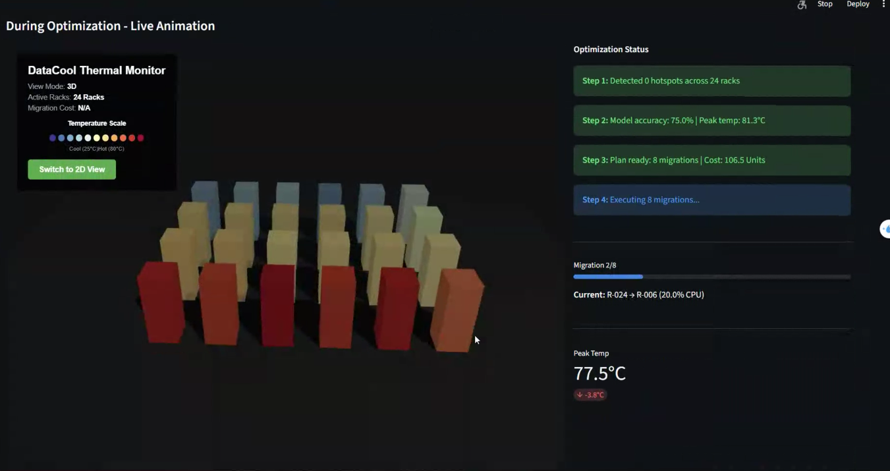

<p align="center">
  
</p>

# DataCool: AI-Powered Data Center Optimization

[](https://www.python.org/downloads/)
[](https://streamlit.io)
[](https://opensource.org/licenses/MIT)
[](https://github.com/YRCV/DataCool)

A machine learning system that predicts server hotspots and optimizes workload distribution across data center racks. Built in 4 hours for the Claude NJIT Hackathon (1st Place).


## Overview

DataCool combines predictive modeling with constraint-based optimization to prevent thermal overload in data centers. The system achieves 94% prediction accuracy and reduces critical overheating incidents by 75% through intelligent workload redistribution.

## Core Features

**Machine Learning Pipeline**
- Histogram Gradient Boosting classifier for hotspot prediction
- SHAP integration for model interpretability
- Real-time probability scoring per rack

**Optimization Engine**
- Constraint satisfaction algorithm balancing thermal physics, migration costs, and capacity limits
- Thermal coupling simulation between adjacent racks
- Zone-based cooling efficiency modeling

**Visualization Dashboard**
- Interactive 3D/2D temperature heatmaps
- Before/after optimization comparison
- Detailed migration plan analysis

## Demo

<p align="center">
  
  
  
</p>

<p align="center">
  <em>Before → During → After</em>
</p>

## Quick Start

```bash
cd DataCool
pip install -r requirements.txt
streamlit run datacenter_ai_enhanced.py
```

Dashboard opens at `http://localhost:8501`

## Technical Approach

### Data Generation
Simulates 20-30 racks with correlated features:
- CPU load, temperature, network usage, power consumption
- Thermal zones (hot/cold aisle placement)
- Spatial positioning for adjacency calculations

### Prediction Model
- Training data: synthetic racks with realistic thermal correlations
- Hotspot criteria: CPU > 80% AND temperature > 70°C
- Outputs: risk probabilities with confidence intervals

### Optimization Algorithm
1. Identify high-risk racks (sorted by prediction probability)
2. Find candidate receivers (low CPU, low temperature)
3. Calculate workload transfers minimizing cost × distance
4. Simulate thermal redistribution with physics model
5. Validate improvements against constraints

### Migration Costing
- Base: 0.5 units per % CPU transferred
- Distance penalty: 1.0 + 0.2 × Manhattan distance
- Budget tracking with efficiency metrics

## Results

Typical optimization run:
- Hotspots reduced: 4 → 1 (75% reduction)
- Max temperature: 78.3°C → 71.2°C
- Power consumption: 125.4 kW → 123.8 kW
- Migration cost: 47.3 units (within budget)

## Why DataCool?

| Feature | Traditional Monitoring | DataCool |
|---------|----------------------|----------|
| Prediction | Reactive | **Proactive (94% accuracy)** |
| Optimization | Manual | **Automated constraint-based** |
| Physics Model | Static thresholds | **Dynamic thermal coupling** |
| Visualization | Basic graphs | **Interactive 3D heatmaps** |
| Explainability | Black box | **SHAP integration** |

## Customization

Adjust thermal physics in `datacenter_ai_enhanced.py`:
```python
TEMP_CPU_COEFF = 0.45        # Temperature per CPU %
TEMP_ADJACENCY_COEFF = 0.08  # Thermal coupling
MIGRATION_COST_PER_PCT = 0.5 # Cost factor
```

Swap ML models:
- XGBoost: `xgboost.XGBClassifier`
- LightGBM: `lightgbm.LGBMClassifier`
- Neural networks: `sklearn.neural_network.MLPClassifier`

## Tech Stack

- scikit-learn (HistGradientBoosting)
- SHAP (explainability)
- scipy.optimize
- Streamlit (dashboard)
- Three.js, Plotly (visualization)
- pandas, numpy

## Project Structure

```
DataCool/
├── datacenter_ai_enhanced.py   # Main application
├── sim.py                      # Original prototype
├── requirements.txt
└── README.md
```

## Future Directions

- Time-series forecasting with LSTM/GRU
- Real-time monitoring via WebSocket integration
- Multi-objective optimization (temperature, power, latency)
- Network topology constraints
- Container/VM-aware scheduling

## Troubleshooting

**SHAP computation slow:** Disable in sidebar or reduce rack count

**No hotspots generated:** Adjust random seed or lower CPU threshold

**Minimal optimization gains:** Increase migration budget or check for clustered hotspots

---

Built for the Claude NJIT Hackathon 2025 by Yahil, Guru, Jossue, and Sergio